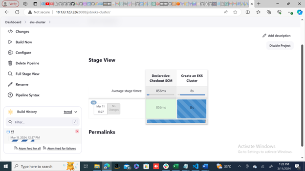
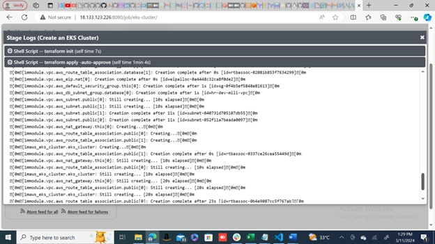
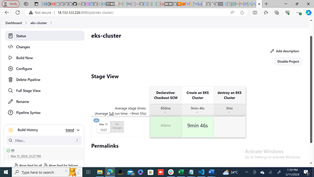

# EKS Pipeline with Terraform and Kubernetes

## 1. Project Statement

This project aims to automate the deployment and management of resources on Amazon EKS (Elastic Kubernetes Service) using Terraform. It provides a Jenkins pipeline that facilitates the creation and destruction of EKS clusters, along with other related resources such as Prometheus monitoring and microservices deployment.

## 2. Project Terms Definition

- **Amazon EKS**: Amazon Elastic Kubernetes Service (EKS) is a managed Kubernetes service provided by AWS.
- **Terraform**: Terraform is an open-source infrastructure as code software tool that enables users to define and provision data center infrastructure using a high-level configuration language.
- **Jenkins Pipeline**: Jenkins Pipeline is a suite of plugins that supports implementing and integrating continuous delivery pipelines into Jenkins.

## 3. Prerequisites

Before using this pipeline, ensure the following prerequisites are met:

- Jenkins installed and configured.
- Terraform installed on the Jenkins server.
- AWS CLI installed and configured on the Jenkins server.
- `kubectl` installed and configured on the Jenkins server.
- Helm installed on the Jenkins server.
- IAM permissions for Terraform to manage resources on AWS.

## 4. Structural Diagram

```
project-root/
├── eks/
│   ├── versions.tf
│   ├── generic-variables.tf
│   ├── local-values.tf
│   ├── vpc-variables.tf
│   ├── vpc-module.tf
│   ├── vpc-outputs.tf
│   ├── ami-datasource.tf
│   ├── eks-variables.tf
│   ├── eks-outputs.tf
│   ├── iamrole-eks.tf
│   ├── iamrole-nodegroup.tf
│   ├── eks-cluster.tf
│   ├── node-group-public.tf
│   ├── eks-auto.tfvars
│   ├── terraform.tfvars
│   └── vpc-auto.tfvars
├── kubernetes/
│   ├── ingress-rule/
│   │   ├── micro.tf
│   │   ├── prome.tf
│   │   └── provider.tf
│   ├── micro-service/
│   │   ├── carts.tf
│   │   ├── catalogue.tf
│   │   ├── front-end.tf
│   │   ├── micro-provider.tf
│   │   ├── orders.tf
│   │   ├── payment.tf
│   │   ├── queue-master.tf
│   │   ├── rabbitmq.tf
│   │   ├── session-db.tf
│   │   ├── shipping.tf
│   │   └── user.tf
│   ├── nginx-controller/
│   │   ├── helm-nginx-ingress.tf
│   │   ├── null.tf
│   │   ├── providers-nginx.tf
│   │   ├── values.yaml
│   │   └── variables.tf
│   └── prometheus-helm/
│       ├── helm-prometheus.tf
│       ├── provider-prometheus.tf
│       ├── values.yaml
│       └── variables.tf
├── cluster-Jenkinsfile
├── installer.sh
└── Jenkinsfile
```

## 5. Step by Step Guidelines for Execution

### Pipeline Execution
1. Open Jenkins and create a new pipeline project.
2. Configure the pipeline to use the provided Jenkinsfile.
3. Run the pipeline and select the desired environment (`create` or `destroy`).

### Execution Scripts

#### Update Ubuntu Server and Install Dependencies
```bash
# scripts/update_server.sh
sudo apt-get update -y
sudo apt-get upgrade -y
sudo apt-get install unzip
sudo apt-get update && sudo apt-get install -y gnupg software-properties-common
```

#### Install Terraform
```bash
# scripts/install_terraform.sh
wget -O- https://apt.releases.hashicorp.com/gpg | \
gpg --dearmor | \
sudo tee /usr/share/keyrings/hashicorp-archive-keyring.gpg

echo "deb [signed-by=/usr/share/keyrings/hashicorp-archive-keyring.gpg] \
https://apt.releases.hashicorp.com $(lsb_release -cs) main" | \
sudo tee /etc/apt/sources.list.d/hashicorp.list

sudo apt-get update && sudo apt-get install terraform
```

#### Install kubectl
```bash
# scripts/install_kubectl.sh
curl -LO "https://dl.k8s.io/release/$(curl -L -s https://dl.k8s.io/release/stable.txt)/bin/linux/amd64/kubectl"
sudo install -o root -g root -m 0755 kubectl /usr/local/bin/kubectl
```

#### Install AWS CLI
```bash
# scripts/install_awscli.sh
curl "https://awscli.amazonaws.com/awscli-exe-linux-x86_64.zip" -o "awscliv2.zip"
unzip awscliv2.zip
sudo ./aws/install --update
```

#### Install Helm
```bash
# scripts/install_helm.sh
curl https://baltocdn.com/helm/signing.asc | gpg --dearmor | sudo tee /usr/share/keyrings/helm.gpg > /dev/null
sudo apt-get install apt-transport-https --yes
echo "deb [arch=$(dpkg --print-architecture) signed-by=/usr/share/keyrings/helm.gpg] https://baltocdn.com/helm/stable/debian/ all main" | sudo tee /etc/apt/sources.list.d/helm-stable-debian.list
sudo apt-get update
sudo apt-get install helm
```

#### Install Jenkins
```bash
# scripts/install_jenkins.sh
sudo apt install fontconfig openjdk-17-jre -y
sudo wget -O /usr/share/keyrings/jenkins-keyring.asc \
  https://pkg.jenkins.io/debian-stable/jenkins.io-2023.key
echo deb [signed-by=/usr/share/keyrings/jenkins-keyring.asc] \
  https://pkg.jenkins.io/debian-stable binary/ | sudo tee \
  /etc/apt/sources.list.d/jenkins.list > /dev/null
sudo apt-get update -y
sudo apt-get install jenkins -y
sudo systemctl enable jenkins
sudo systemctl start jenkins
sudo systemctl status jenkins
sudo ufw allow OpenSSH 
sudo ufw enable
sudo ufw allow 8080
sudo ufw status
```

## 6. Screen Shots from the Project

JENKINS CONFIGURATION
After Jenkins installation on the instance, copy the instance Public IP and paste it on any web browser with port 80 to load Jenkens GUI. 
For this deployment, we have pasted 18.133.123.226:80 on browser to get the page below


The Administrator password from the above page can be obtained by copy the directory printed in red on the page and paste it to complete a command on your CLI thus:
Sudo cat /var/lib/Jenkins/secrets/initialAdminPassword
Execute the command and the password will be displayed on top of the command line prompt. Copy the password and paste on the page. Then click “continue” to have the next page


Fill the above form as shown on the page below


Click “save and continue” and you will have the next page


Click “safe and finish”


Click “start using Jenkins”







## 7. Contribution

Contributions to this project are welcome! To contribute, please fork the repository, make your changes, and submit a pull request.

## 8. License

This project is licensed under the MIT License. See the [LICENSE](LICENSE) file for details.

---

This README.md file provides a comprehensive guide to understanding and using the EKS pipeline with Terraform and Kubernetes. It includes project statement, terms definition, prerequisites, structural diagram, step-by-step execution guidelines, contribution instructions, and licensing information.

Feel free to reach out if you have any questions or need further assistance.